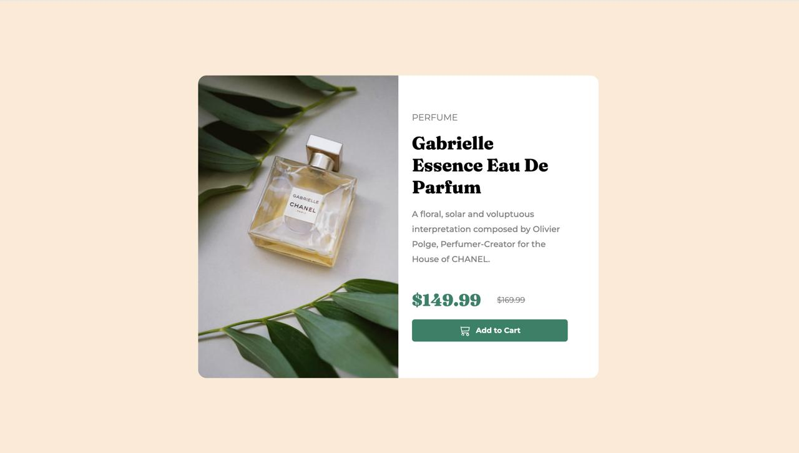

# Frontend Mentor - Product preview card component solution

This is a solution to the [Product preview card component challenge on Frontend Mentor](https://www.frontendmentor.io/challenges/product-preview-card-component-GO7UmttRfa). Frontend Mentor challenges help you improve your coding skills by building realistic projects. 

## Table of contents

- [Overview](#overview)
  - [The challenge](#the-challenge)
  - [Screenshot](#screenshot)
  - [Links](#links)
- [My process](#my-process)
  - [Built with](#built-with)
- [Author](#author)

**Note: Delete this note and update the table of contents based on what sections you keep.**

## Overview

### Screenshot

\\
\\

### Links

- Solution URL: [Add solution URL here]()
- Live Site URL: [Add live site URL here]()

## My process

### Built with

- Semantic HTML5 markup
- CSS custom properties

## Author

- Frontend Mentor - [@sarachafikidrissi](https://www.frontendmentor.io/profile/sarachafikidrissi)
- Twitter - [@SaraChafikIdri1](https://twitter.com/SaraChafikIdri1)